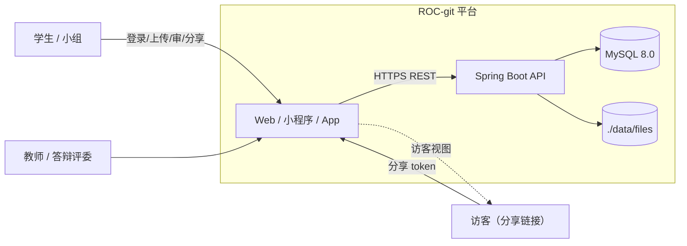
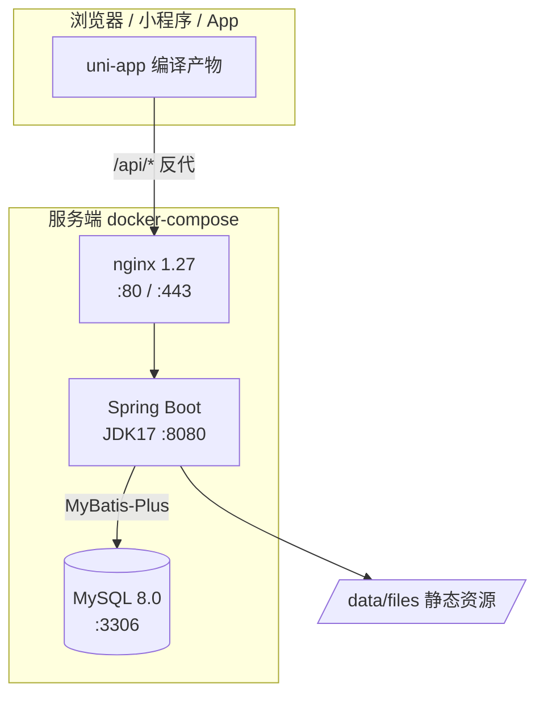
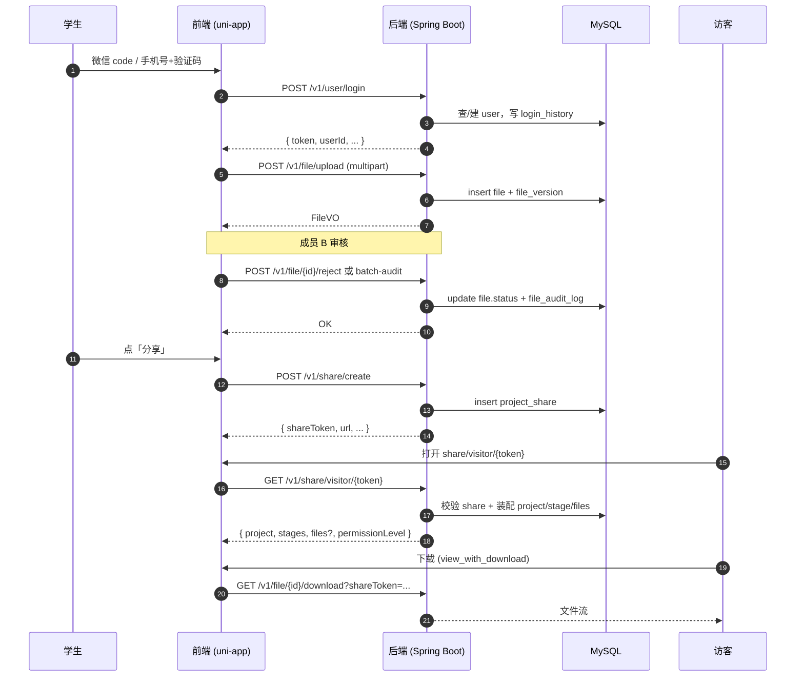
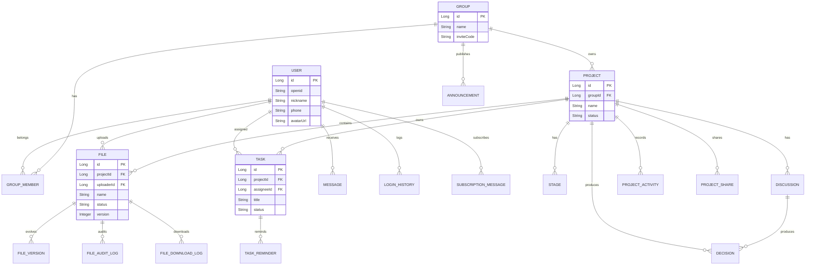

# 架构图（C4 + 序列）

## 系统上下文图（C4 Level 1）

```mermaid
graph LR
    Student[学生 / 小组]
    Teacher[教师 / 答辩评委]
    Visitor[访客（分享链接）]

    subgraph ROC[ROC-git 平台]
        WebApp[Web / 小程序 / App]
        API[Spring Boot API]
        MySQL[(MySQL 8.0)]
        Files[(./data/files)]
    end

    Student -->|登录/上传/审/分享| WebApp
    WebApp -->|HTTPS REST| API
    API --> MySQL
    API --> Files

    Teacher --> WebApp
    Visitor -->|分享 token| WebApp
    WebApp -. 访客视图 .-> Visitor
```

## 容器图（C4 Level 2）

```mermaid
graph TB
    subgraph Browser[浏览器 / 小程序 / App]
        UI[uni-app 编译产物]
    end

    subgraph Server[服务端 docker-compose]
        Nginx[nginx 1.27<br/>:80 / :443]
        Backend[Spring Boot<br/>JDK17 :8080]
        DB[(MySQL 8.0<br/>:3306)]
    end

    UI -->|/api/* 反代| Nginx
    Nginx --> Backend
    Backend -->|MyBatis-Plus| DB
    Backend --> Files[/data/files 静态资源/]
```

## 核心流程：登录 → 上传 → 审核 → 分享 → 访客访问

```mermaid
sequenceDiagram
    autonumber
    participant U as 学生
    participant FE as 前端 (uni-app)
    participant BE as 后端 (Spring Boot)
    participant DB as MySQL
    participant V as 访客

    U->>FE: 微信 code / 手机号+验证码
    FE->>BE: POST /v1/user/login
    BE->>DB: 查/建 user，写 login_history
    BE-->>FE: { token, userId, ... }
    FE->>BE: POST /v1/file/upload (multipart)
    BE->>DB: insert file + file_version
    BE-->>FE: FileVO

    Note over FE,BE: 成员 B 审核
    FE->>BE: POST /v1/file/{id}/reject 或 batch-audit
    BE->>DB: update file.status + file_audit_log
    BE-->>FE: OK

    U->>FE: 点「分享」
    FE->>BE: POST /v1/share/create
    BE->>DB: insert project_share
    BE-->>FE: { shareToken, url, ... }

    V->>FE: 打开 share/visitor/{token}
    FE->>BE: GET /v1/share/visitor/{token}
    BE->>DB: 校验 share + 装配 project/stage/files
    BE-->>FE: { project, stages, files?, permissionLevel }
    V->>FE: 下载 (view_with_download)
    FE->>BE: GET /v1/file/{id}/download?shareToken=...
    BE-->>V: 文件流
```

## ER 概览（22 张表）

```mermaid
erDiagram
    USER ||--o{ GROUP_MEMBER : belongs
    USER ||--o{ FILE : uploads
    USER ||--o{ TASK : assigned
    USER ||--o{ MESSAGE : receives
    USER ||--o{ LOGIN_HISTORY : logs
    USER ||--o{ SUBSCRIPTION_MESSAGE : subscribes

    GROUP ||--o{ GROUP_MEMBER : has
    GROUP ||--o{ PROJECT : owns
    GROUP ||--o{ ANNOUNCEMENT : publishes

    PROJECT ||--o{ STAGE : has
    PROJECT ||--o{ FILE : contains
    PROJECT ||--o{ TASK : owns
    PROJECT ||--o{ DISCUSSION : has
    PROJECT ||--o{ DECISION : produces
    PROJECT ||--o{ PROJECT_ACTIVITY : records
    PROJECT ||--o{ PROJECT_SHARE : shares

    FILE ||--o{ FILE_VERSION : evolves
    FILE ||--o{ FILE_AUDIT_LOG : audits
    FILE ||--o{ FILE_DOWNLOAD_LOG : downloads

    TASK ||--o{ TASK_REMINDER : reminds
    DISCUSSION ||--o{ DECISION : produces

    USER {
        Long id PK
        String openid
        String nickname
        String phone
        String avatarUrl
    }
    GROUP {
        Long id PK
        String name
        String inviteCode
    }
    PROJECT {
        Long id PK
        Long groupId FK
        String name
        String status
    }
    FILE {
        Long id PK
        Long projectId FK
        Long uploaderId FK
        String name
        String status
        Integer version
    }
    TASK {
        Long id PK
        Long projectId FK
        Long assigneeId FK
        String title
        String status
    }
```
